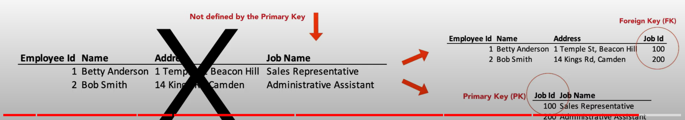

# SQL Normalization

https://www.youtube.com/watch?v=SK4H5tTT6-M

## Intro

5 Rules for making data "normal" which build over each (so to be in 3rd normal form the data must be in 1st normal form)

- The first 3 are for core basics
- The latest 2 are for exceptions

The magic of data lies in its relationships and types of relationships - Cardinality

So, we are gonna focus in the core (first three Normal Forms)

## 1st Normal Form (1NF)

It's about Atomic Value and Unique Identifiers. The rules for normalization:

Our Initial table:

### 1. A cell must never contain more than one value

### 2. Each row must be unique

One Column, _or a combination of columns_, must be able to uniquely identify the row (primary key)

- Primary keys often (but not necessairly) are system generated
- In our example we generated it via system (but could be 'Name+Address')

### 3. Each column name must be unique

### 4. There must be no repeating groups

They must me moved to a new table

## 2nd Normal Form (2NF)

### 1. All Data must depend on the Primary Key (PK)

So, any column that doesn't depend on the primary key must be split on its own table

A primary key that links to another table is a foreign key (FK)

## 3rd Normal Form

### 1. The PK must fully define all Non-Key Column and Non-key columns must not depend on any other Key

In our example, the Job Name was not defined by the primary key, SO, we had to create a new table for it

## Summary

